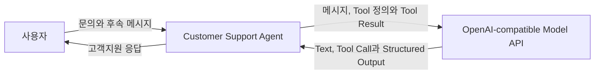
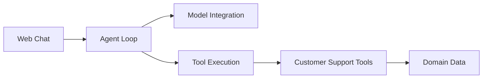
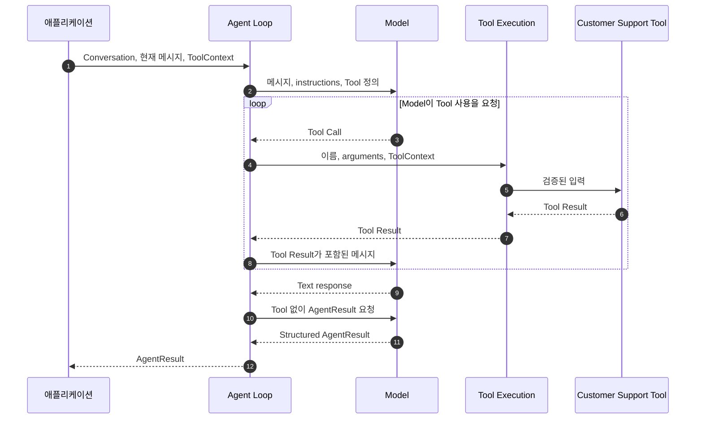
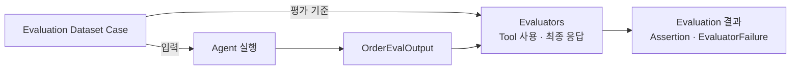

# Architecture

이 문서는 Customer Support Agent의 주요 경계와 구성 요소, 의존 방향과 실행
흐름을 설명합니다.

프로젝트 용어는 [Project Context](CONTEXT.md)의 정의를 따릅니다.

## 시스템 컨텍스트

Customer Support Agent는 사용자의 주문 관련 문의를 받아 고객지원 응답을
제공하는 하나의 시스템입니다. 시스템 내부에는 Web Chat, Agent Loop, Tool과
가상 Domain Data가 포함됩니다. 응답 생성과 Tool 사용 판단에는 외부의
OpenAI-compatible Model API를 사용합니다.

Model은 Tool 사용을 요청할 수 있지만 Tool을 직접 실행하지 않습니다. Tool 실행과
그 결과를 다음 Model 호출에 전달하는 책임은 Customer Support Agent 시스템에
있습니다.

## 내부 구성 요소

아래 다이어그램은 Customer Support Agent 내부 구성 요소와 이들 사이의 의존
방향을 보여줍니다. 실행 시간의 호출 순서는
[Agent 실행 흐름](#agent-실행-흐름)에서 별도로 설명합니다.

| 구성 요소 | 책임 |
| --- | --- |
| [Web Chat](../src/customer_support_agent/web_chat.py) | 사용자 메시지와 이전 채팅 이력을 Agent 실행에 연결하고 결과를 화면에 표시합니다. Model 호출이나 Tool 실행을 직접 관리하지 않습니다. |
| [Customer Support 구성](../src/customer_support_agent/customer_support.py) | 고객지원 instructions와 Toolset을 Model과 조립해 완성된 Agent를 만듭니다. 이 조립 책임은 실행 흐름과 분리되어 있으므로 구성도에는 별도 실행 구성 요소로 표시하지 않았습니다. |
| [Agent Loop](../src/customer_support_agent/agent.py) | Conversation과 현재 사용자 메시지를 Model 입력으로 만들고 Model 호출, Tool 실행 결과 전달과 최종 결과 생성을 조정합니다. |
| [Model Integration](../src/customer_support_agent/models) | Agent가 의존하는 `ChatModel` 계약을 제공하고 프로젝트의 메시지와 Tool 정보를 OpenAI 호환 API 형식으로 변환합니다. |
| [Tool Execution](../src/customer_support_agent/tools/toolset.py) | Model이 요청한 Tool을 이름으로 찾고, arguments를 검증해 `ToolContext`와 함께 실행합니다. |
| [Customer Support Tools](../src/customer_support_agent/tools) | 고객 범위의 주문·배송 정보와 전역 취소 정책을 읽기 전용으로 조회해 구조화된 결과를 반환합니다. |
| [Domain Data](../src/customer_support_agent/domain) | 대표 고객지원 흐름을 결정적으로 재현하는 최소 주문, 배송과 취소 정책 사실을 제공합니다. |

이 구조의 핵심 의존 규칙은 다음과 같습니다.

- Web Chat은 완성된 Agent만 주입받으며 Model 설정, Toolset과 instructions를
  소유하지 않습니다.
- Agent Loop는 특정 Model provider가 아니라 `ChatModel` 계약에 의존합니다.
- Model은 Tool Call을 생성하고 Agent Loop는 그 요청을 검증·실행합니다.
- Model이 생성하는 Tool arguments와 달리 `customer_id` 같은 `ToolContext`는
  애플리케이션이 제공하며 Tool 정의에 노출되지 않습니다.
- Customer Support Tools는 읽기 전용 Domain Data에 의존하고 Agent, Model 또는
  Web Chat에는 의존하지 않습니다.

## Agent 실행 흐름

하나의 `Agent.run()` 안에서 사용자 요청이 Tool 실행을 거쳐 최종
`AgentResult`가 되는 흐름은 다음과 같습니다.

Model이 여러 Tool을 요청하면 Tool Call과 Tool Result를 누적한 채 같은 흐름을
반복합니다. 이 실행 기록은 해당 `Agent.run()` 안에서만 유지되며, Model 호출
한도에 도달하거나 유효한 최종 결과를 만들 수 없으면 `AgentError`로
종료합니다.

## Conversation과 실행 상태

지속 시간과 소유권이 다른 정보를 분리해 관리합니다.

| 정보 | 소유자 | 지속 시간 | 내용 |
| --- | --- | --- | --- |
| Conversation | 애플리케이션 | 여러 Agent 실행 | 사용자 메시지와 고객에게 전달된 Agent 메시지 |
| 현재 사용자 메시지 | 애플리케이션 | 한 번의 Agent 실행 | 현재 요청이며 이전 Conversation과 분리해 전달됨 |
| `ToolContext` | 애플리케이션 | 한 번의 Agent 실행 | 현재 고객처럼 Model이 결정해서는 안 되는 실행 정보 |
| Model 메시지와 Tool 실행 기록 | Agent Loop | 한 번의 Agent 실행 | Model 요청·응답, Tool Call과 Tool Result |
| Agent 구성 | Customer Support 구성 | Agent 인스턴스 | Model, Toolset과 고객지원 instructions |

Agent 자체는 고객별 Conversation을 저장하지 않습니다. Web Chat은 현재 페이지의
채팅 이력을 Conversation으로 변환해 매 실행에 전달합니다. 따라서 같은 Agent
인스턴스에 서로 다른 Conversation을 전달해도 대화가 섞이지 않으며, 이전
실행의 Tool Call과 Tool Result는 다음 Conversation에 포함되지 않습니다.

## 실행 결과와 오류 처리

| 결과 | 의미 | 전달 위치 |
| --- | --- | --- |
| Tool 성공 또는 구조화된 Tool 오류 | 조회 결과 또는 Tool이 정보를 제공하지 못한 이유 | Agent Loop가 다음 Model 호출에 전달 |
| `AgentResult` | 고객에게 전달할 수 있는 최종 응답 | 애플리케이션과 Web Chat |
| `AgentError` | Model 호출 실패, 해석할 수 없는 응답 또는 호출 한도 초과로 Agent 실행을 완료하지 못함 | 애플리케이션의 오류 처리 경계 |

Web Chat은 `AgentResult.message`를 Agent 응답으로 표시합니다. `AgentError`는 Agent
응답으로 Conversation에 저장하지 않고 내부 세부 정보를 제외한 일반적인 오류
안내로 표시합니다.

## Evaluation pipeline

Evaluation은 고객 문의를 처리하는 Agent 실행 경로와 분리된 검증 흐름입니다.
Order Evaluation Dataset의 각 case는 Agent 실행 입력과 기대 동작을 제공하고,
Evaluator는 Agent 실행 결과가 그 기대를 충족하는지 판정합니다.

### 구성 요소와 책임

현재 구현된 Evaluation 구성 요소와 각 책임은 다음과 같습니다.

| 구성 요소 | 책임 |
| --- | --- |
| [Order Evaluation Dataset](../evals/order/scenario_cases.yaml) | case별 Agent 입력, 기대 Tool 사용과 response criterion을 정의합니다. |
| [Dataset Loader](../evals/order/dataset.py) | Dataset을 읽고 공통 Tool evaluator와 case별 response evaluator를 연결합니다. |
| [Tool Use Capture](../evals/order/capture.py) | Agent 실행 중 Model 메시지의 Tool Call과 대응하는 Tool Result를 관측된 Tool 사용으로 변환합니다. |
| [`OrderEvalOutput`](../evals/order/models.py) | Agent의 최종 응답과 한 실행에서 관측한 Tool 사용을 Evaluator에 전달합니다. |
| [Tool Evaluators](../evals/order/tool_evaluators.py) | 기대 Tool 사용과 관측된 Tool 사용을 비교합니다. 모든 case에 적용되는 dataset-level evaluator입니다. |
| [Response Evaluator](../evals/order/response_evaluator.py) | 최종 응답이 하나의 response criterion을 충족하는지 판정합니다. criterion별로 해당 case에 연결되는 case-specific evaluator입니다. |

현재 구성은 Dataset과 Evaluator를 정의하고 연결하는 단계까지 포함합니다. 실제 Agent
실행, `OrderEvalOutput` 조립, Evaluation report 처리와 Logfire 연결은 #41에서
구현합니다.

### Evaluator의 역할

Tool Evaluator는 Agent가 답을 만드는 과정에서 Tool을 적절하게 사용했는지
판정합니다. Response Evaluator는 각 response criterion에 기술된 행동이 최종 응답에서
관찰되는지를 Judge로 판정합니다. Required criterion은 해당 행동이 관찰되어야 통과하고,
Forbidden criterion은 관찰되지 않아야 통과합니다. 따라서 Judge의 행동 관찰 결과와 최종
Evaluation assertion의 통과 여부는 서로 다른 의미일 수 있습니다. 두 Evaluator는 같은
case를 서로 다른 관점에서 독립적으로 평가합니다.

| 구분 | Tool Evaluator | Response Evaluator |
| --- | --- | --- |
| 평가 대상 | Tool 선택, arguments, outcome과 명시된 실행 순서 | 최종 응답의 response criterion 충족 여부 |
| 입력 | case metadata의 기대 Tool 사용과 `OrderEvalOutput.tool_uses` | user message, `AgentResult.message`와 하나의 response criterion |
| 판정 방식 | 구조화된 값을 비교하는 결정론적 코드 | LLM Judge를 사용하는 의미 판정 |
| 연결 범위 | Dataset level | Case level |
| 결과 | Tool 사용 기준별 assertion | response criterion별 assertion |

예를 들어 `order-003`의 상태를 묻는 case에서 Agent가
`find_order(order_id="order-003")`를 올바르게 호출했지만 최종 응답에서 주문 상태를
`processing`이라고 말했다고 가정합니다. 이 경우 Tool Evaluator는 Tool 선택과
arguments가 기준을 충족했다고 판정하지만, Response Evaluator는 주문 상태가
`delivered`임을 설명해야 한다는 criterion을 충족하지 못했다고 판정합니다. 이처럼
올바른 Tool 사용이 올바른 최종 응답을 보장하지 않으므로 두 결과를 독립적으로
평가합니다.

Evaluator가 판정을 완료하면 기준 충족 여부가 assertion으로 기록됩니다. 예외로 인해
판정을 완료하지 못하면 assertion 대신 `EvaluatorFailure`가 기록됩니다. 한
Evaluator의 failure는 같은 case의 다른 Evaluator 결과를 failure로 바꾸지 않습니다.

현재 #40까지는 Dataset, `OrderEvalOutput`, Tool Evaluator, Response Evaluator와 이들의
연결이 구축되어 있습니다. 실제 Agent와 Judge Model을 사용한 전체 Dataset 실행,
Evaluation report의 표시와 저장, Logfire experiment 및 Trace 연결은 #41의 실행
경계에 남아 있습니다.
