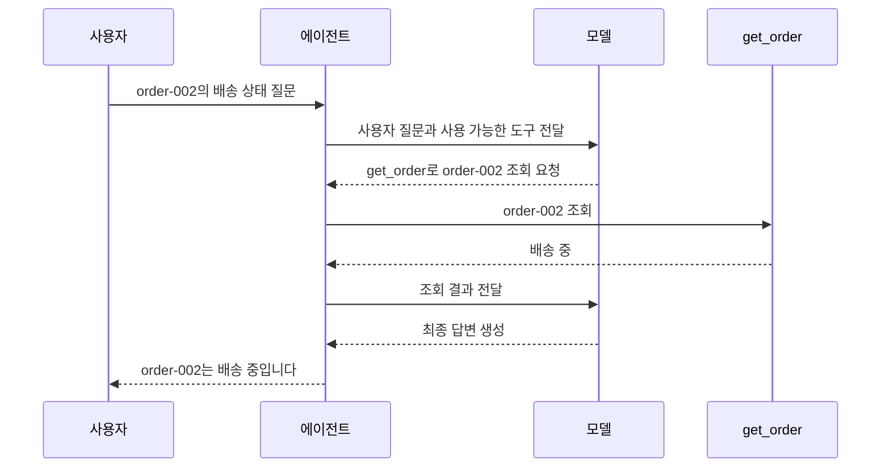
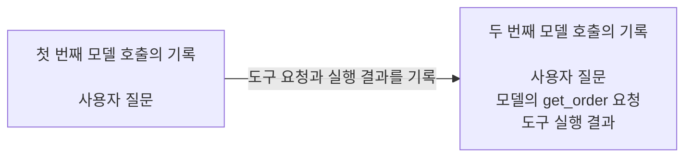
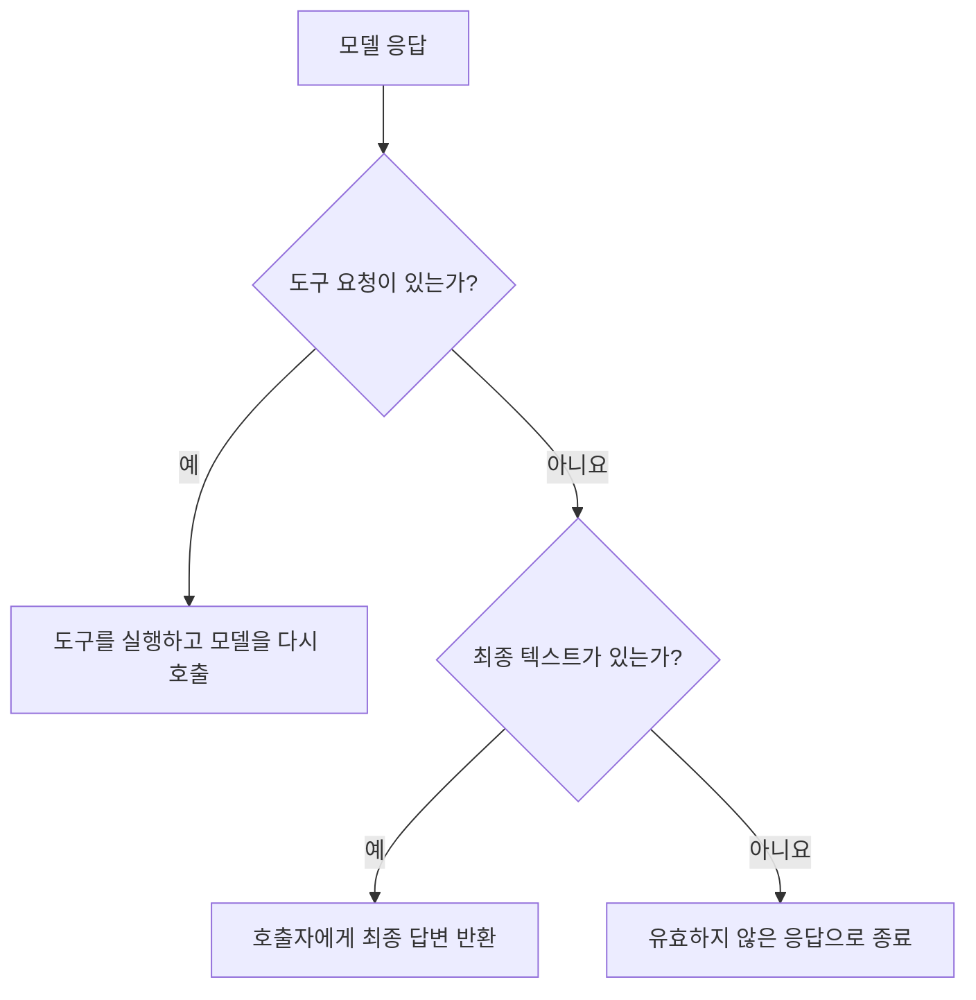

# Agent Loop with Tool Calling

이 문서는 이 프로젝트의 Agent Loop가 모델의 Tool Calling을 처리하는 흐름을 설명합니다.
모델, 애플리케이션, 도구 사이의 책임과 반복·종료 조건을 정리한 개념 문서입니다.

## Agent Loop란 무엇인가

`Agent Loop`는 LLM의 응답을 한 번 받아 끝내는 대신, 모델이 선택한 행동을
애플리케이션이 실행하고 그 결과를 다음 모델 호출에 반영하는 실행 주기입니다. 모델이 최종
응답을 만들거나 애플리케이션이 정한 중단 조건에 도달할 때까지 이 주기를 반복합니다.

[OpenAI Agents SDK의 Agent Loop 설명](https://openai.github.io/openai-agents-python/running_agents/#the-agent-loop)은
모델을 호출한 뒤 최종 출력이면 종료하고, 도구 호출이면 도구를 실행해 결과를 추가한 후
모델을 다시 호출하는 흐름으로 정의합니다.
[Anthropic의 Building Effective Agents](https://www.anthropic.com/engineering/building-effective-agents)는
에이전트를 환경의 피드백에 따라 도구를 사용하는 LLM의 반복 구조로 설명하며, 작업 완료와
최대 반복 횟수 같은 중단 조건을 함께 다룹니다.

이 문서에서는 두 설명의 공통 구조를 다음과 같이 `Agent Loop`라고 부릅니다.

> 현재 메시지 기록과 사용 가능한 도구를 모델에 전달하고, 모델이 선택한 행동을 실행해 그
> 결과를 메시지 기록에 추가한 뒤, 최종 응답 또는 중단 조건에 도달할 때까지 모델을 다시
> 호출하는 애플리케이션 제어 흐름

### 이 프로젝트에서 구현한 범위

이 프로젝트는 Agent Loop의 기본 구조를 이해하고 검증하기 위해, 하나의 에이전트가
`get_order` 도구 하나를 동기적으로 사용하는 범위로 구현했습니다. 각 실행은 독립된 메시지
기록을 사용하며, 최대 5회의 모델 호출 안에서 도구 실행과 결과 전달을 반복합니다.

## 구성요소와 책임

| 구성요소                    | 책임                                                                                           |
| --------------------------- | ---------------------------------------------------------------------------------------------- |
| 사용자                      | 질문을 전달하고 에이전트의 최종 답변을 받습니다. 이 예시에서는 `order-002`의 배송 상태를 묻습니다. |
| 에이전트                    | 메시지 기록을 관리하고 모델 호출과 도구 실행, 반복과 종료를 제어합니다.                        |
| 모델                        | 메시지 기록과 사용할 수 있는 도구를 바탕으로 도구를 요청하거나 최종 답변을 생성합니다.         |
| 주문 조회 도구 (`get_order`) | 주문 ID를 검증하고 주문 정보 또는 오류 결과를 반환합니다.                                     |

모델은 어떤 도구를 어떤 입력으로 사용할지 응답으로 요청합니다. 에이전트는 그 요청을 해석해
도구를 실행하고, 실행 결과를 모델에게 전달합니다.

## 핵심 흐름

다음은 사용자가 `order-002`의 배송 상태를 질문했을 때의 실행 예시입니다. 모델이 만드는
최종 답변의 문장은 달라질 수 있지만, 도구를 사용하고 결과를 돌려받는 흐름은 같습니다.

모델은 `get_order`를 직접 실행하지 않습니다. 어떤 도구를 어떤 정보로 사용할지
에이전트에 요청하고, 에이전트가 도구를 실행하여 결과를 모델에 전달합니다.

이 예시에는 두 번의 모델 호출이 있습니다. 첫 번째 호출에서 모델은 `get_order` 사용을
요청하고, 두 번째 호출에서 조회 결과를 바탕으로 최종 답변을 만듭니다. 두 번째 호출에서도
모델이 도구 사용을 요청하면 에이전트는 도구 실행과 모델 호출을 같은 방식으로 반복합니다.

### 1. 메시지 기록은 어떻게 이어지는가?

각 에이전트 실행은 사용자의 새로운 질문으로 메시지 기록을 시작합니다. 모델이 도구를
요청하면 그 요청을 기록하고, 에이전트가 도구를 실행하면 실행 결과도 이어서 기록합니다.

다음 모델 호출에는 지금까지 누적된 전체 기록이 전달됩니다. `order-002` 예시의 두 번째
호출에는 사용자 질문, 모델의 `get_order` 요청, 배송 상태 조회 결과가 함께 들어갑니다.
모델은 이 흐름을 바탕으로 최종 답변을 만들거나 다음 행동을 선택할 수 있습니다.

### 2. 모델은 사용할 수 있는 도구를 어떻게 아는가?

에이전트는 모델을 호출할 때 메시지 기록과 함께 사용할 수 있는 도구의 정보를 전달합니다.
도구 정보에는 이름과 용도, 도구를 사용하기 위해 필요한 입력이 포함됩니다.

이 프로젝트는 `get_order`를 주문 ID로 주문 정보를 조회하는 도구로 설명하고,
`order_id`가 필요하다는 것을 모델에 알려줍니다. 모델은 이 설명을 바탕으로 도구 사용
여부와 입력값을 결정합니다. 실제 도구 실행은 모델의 요청을 받은 에이전트가 담당합니다.

### 3. 모델 응답은 다음 행동을 어떻게 결정하는가?

에이전트는 모델 응답에 도구 요청이 있는지 먼저 확인합니다. 도구 요청이 있으면 도구 실행
경로를 선택하고, 도구 요청 없이 표시 가능한 텍스트가 있으면 최종 답변으로 반환합니다.

모델이 텍스트와 도구 요청을 함께 반환한 경우에도 도구 요청을 먼저 처리합니다. 이때의
텍스트는 최종 답변으로 사용하지 않고, 도구 결과를 전달한 뒤 모델의 다음 응답을 기다립니다.

### 4. 도구 실행 결과는 어떻게 처리되는가?

에이전트는 모델이 반환한 순서대로 도구 요청을 하나씩 처리합니다. `get_order`는 입력을
검증한 뒤 주문 정보를 반환하며, 입력이 잘못되었거나 주문을 찾을 수 없는 경우에는 오류를
구조화된 결과로 반환합니다.

모델이 사용할 수 없는 도구를 요청하거나 도구 실행 중 예상하지 못한 문제가 발생한
경우에도 에이전트는 오류를 구조화된 결과로 만듭니다. 도구의 정상 결과와 오류 결과는 모두
모델에 전달되므로, 모델은 결과를 설명하거나 다른 행동을 선택할 수 있습니다.

한 번의 모델 응답에 여러 도구 요청이 있으면 각 요청을 반환된 순서대로 실행하고, 각 결과가
어떤 요청에서 나온 것인지 구분하여 함께 기록합니다.

### 5. 반복은 언제 끝나는가?

| 상황                              | 에이전트의 처리                                  |
| --------------------------------- | ------------------------------------------------ |
| 표시 가능한 최종 텍스트           | 호출자에게 최종 답변을 반환합니다.               |
| 도구 요청                         | 도구를 실행하고 모델을 다시 호출합니다.          |
| 도구의 입력 또는 실행 오류        | 오류 결과를 모델에 전달하고 실행을 이어갑니다.   |
| 모델 API 호출 실패                | 복구할 수 없는 실행 실패로 종료합니다.           |
| 최종 텍스트와 도구 요청이 모두 없음 | 유효하지 않은 응답으로 실행을 종료합니다.        |
| 다음 모델 호출이 호출 한도를 초과 | 모델 호출 한도에 도달한 실행 실패로 종료합니다.  |

현재 한 번의 에이전트 실행에서 모델은 최대 5회 호출됩니다. 다섯 번째 모델 응답이 최종
텍스트이면 호출자에게 반환합니다. 다섯 번째 응답이 도구 요청이면 그 결과를 다시 모델에
전달할 수 없으므로 도구를 실행하기 전에 종료합니다.
