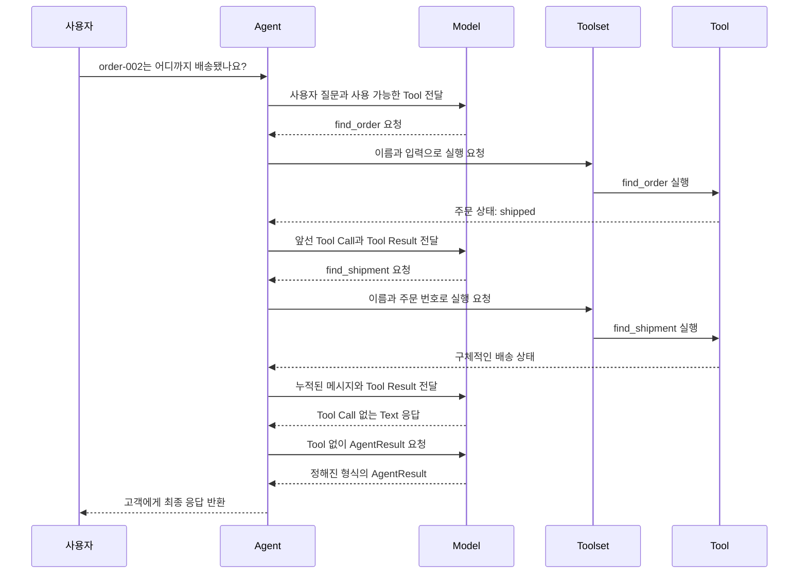

# Agent Loop with Tool Calling

이 문서는 이 프로젝트의 Agent Loop가 여러 Tool을 사용하는 핵심 원리를 설명합니다.
구현 API를 나열하기보다 Agent, Model, Tool이 어떤 책임을 나누고 하나의 고객지원 흐름을
만드는지 이해하는 것이 목적입니다.

## Agent Loop란 무엇인가

`Agent Loop`는 Model의 응답을 한 번 받아 끝내는 대신, Model이 요청한 Tool을 Agent가
실행하고 그 결과를 다음 Model 호출에 반영하는 실행 주기입니다. Model이 최종 응답을
만들거나 Agent가 정한 중단 조건에 도달할 때까지 이 주기를 반복합니다.

[OpenAI Agents SDK의 Agent Loop 설명](https://openai.github.io/openai-agents-python/running_agents/#the-agent-loop)은
Model을 호출한 뒤 최종 출력이면 종료하고, Tool Call이면 Tool을 실행해 결과를 추가한 후
Model을 다시 호출하는 흐름으로 정의합니다.
[Anthropic의 Building Effective Agents](https://www.anthropic.com/engineering/building-effective-agents)는
환경의 피드백에 따라 Tool을 사용하는 반복 구조와 작업 완료, 최대 반복 횟수 같은 중단
조건을 함께 설명합니다.

이 문서에서는 두 설명의 공통 구조를 다음과 같이 `Agent Loop`라고 부릅니다.

> 현재 메시지 기록과 사용 가능한 Tool을 Model에 전달하고, Model이 요청한 Tool을 Agent가
> 실행해 그 결과를 메시지 기록에 추가한 뒤, 최종 응답 또는 중단 조건에 도달할 때까지
> Model을 다시 호출하는 애플리케이션 제어 흐름

## 하나의 Tool에서 여러 Tool로

하나의 Tool만 제공하면 Model이 결정할 것은 그 Tool을 사용할지 여부뿐입니다. 여러 Tool을
제공하면 Model은 사용자 문의와 앞선 실행 결과를 바탕으로 어떤 정보가 더 필요한지 판단해야
합니다.

현재 Customer Support Agent는 다음과 같이 책임이 다른 Tool을 사용할 수 있습니다.

| Tool                      | 제공하는 정보                                   |
| ------------------------- | ----------------------------------------------- |
| `get_customer_orders`     | 현재 고객이 소유한 주문 목록과 각 주문의 상태  |
| `find_order`              | 주문 번호가 주어진 주문의 현재 상태            |
| `find_shipment`           | 배송 정보가 존재하는 주문의 구체적인 배송 상태 |
| `get_cancellation_policy` | 취소할 수 있는 주문 상태를 정의한 정책 사실    |

Tool은 특정 문의 유형 전체를 처리하지 않고 하나의 정보원에 책임을 가집니다. 예를 들어 배송
문의라고 해서 정해진 배송 처리 함수를 실행하는 것이 아닙니다. 주문 번호가 없다면 Model은 먼저
주문 목록을 요청하고 고객에게 어떤 주문인지 확인해야 합니다. 주문이 특정된 뒤에는 주문 상태를
확인한 결과에 따라 배송 정보가 필요한지 판단할 수 있습니다.

따라서 여러 Tool을 사용한다는 것은 단순히 실행 가능한 함수의 수가 늘어나는 것을 넘어,
앞선 결과에 따라 다음 행동이 달라지는 흐름을 만든다는 의미입니다.

## 각 구성요소의 책임

| 구성요소 | 책임                                                                    |
| -------- | ----------------------------------------------------------------------- |
| 사용자   | 문의를 전달하고 Agent의 최종 응답을 받습니다.                           |
| Agent    | 메시지 기록, Model 호출, Tool 실행, 반복과 종료를 제어합니다.           |
| Model    | 메시지와 Tool 정보를 바탕으로 Tool 사용을 요청하거나 응답을 생성합니다. |
| Tool     | 입력을 검증하고 한정된 정보 조회 또는 동작을 수행합니다.                |
| Toolset  | Agent가 사용할 수 있는 여러 Tool을 하나의 집합으로 제공합니다.          |

Model은 Tool을 직접 실행하지 않습니다. 사용할 Tool의 이름과 입력을 응답으로 만들 뿐입니다.
Agent가 그 요청에 맞는 Tool을 찾아 실행하고 결과를 다시 Model에게 전달합니다.

Toolset에 Tool이 포함되어 있다는 사실도 해당 Tool이 항상 실행된다는 뜻은 아닙니다. Agent는
사용 가능한 모든 Tool의 정보를 Model에게 제공하고, 실제 선택은 매 Model 응답에서 이루어집니다.

## 여러 Tool이 하나의 흐름을 만드는 방법

주문 번호가 없다면 주문 목록을 조회한 뒤 고객에게 어떤 주문인지 확인해야 하며, 주문이
특정되기 전에는 배송 조회를 계속하지 않습니다.

다음은 사용자가 주문 번호를 알고 있는 상태에서 배송 상황을 묻는 예시입니다. 실제로 선택되는
Tool과 최종 답변의 문장은 Model의 판단에 따라 달라질 수 있습니다.



Agent는 각 Model 호출에 지금까지 누적된 메시지 기록을 전달합니다. 따라서 두 번째 Tool을
선택하는 시점의 Model은 사용자 질문뿐 아니라 첫 번째 Tool Call과 그 결과도 알고 있습니다.
이 누적된 결과가 다음 행동을 결정할 근거가 됩니다.

한 Model 응답에 여러 Tool Call이 포함될 수도 있습니다. Agent는 요청된 순서대로 각 Tool을
실행하고, 각 Tool Result를 원래 Tool Call과 연결해 기록합니다. 이 연결이 있어야 Model이
어떤 요청에서 어떤 결과가 나왔는지 구분할 수 있습니다.

## Tool 입력은 어디에서 오는가

Tool 실행에 필요한 모든 값을 Model이 결정하게 해서는 안 됩니다. 현재 구현은 입력을 두
종류로 구분합니다.

| 입력의 출처 | 예시          | 의미                                                    |
| ----------- | ------------- | ------------------------------------------------------- |
| Model       | `order_id`    | 문의를 처리하기 위해 Model이 선택하는 Tool 인자         |
| 애플리케이션 | `customer_id` | 현재 요청이 어떤 고객 범위에서 실행되는지 나타내는 정보 |

`order_id`는 대화와 앞선 조회 결과에 따라 달라질 수 있으므로 Model이 선택합니다. 반면
`customer_id`는 Model이 추측하거나 변경할 값이 아닙니다. Agent를 호출하는 애플리케이션이
신뢰할 수 있는 값으로 제공하고, Agent가 Tool 실행 시 전달합니다.

현재 구현에서 `ToolContext`는 이처럼 Tool 실행에 필요하지만 Model에게 선택권을 주지 않는
정보를 표현합니다. Conversation이나 Tool 실행 기록을 저장하는 객체는 아닙니다.

이 구분 덕분에 Model은 고객지원 판단에 필요한 인자만 만들고, Tool은 애플리케이션이 정한
고객 범위를 벗어나지 않은 상태에서 실행됩니다.

## 함수가 Agent의 Tool이 되는 과정

이 프로젝트에서는 `@tool`로 선언한 함수가 Agent가 사용할 수 있는 Tool이 됩니다. 함수의
이름과 설명, 입력 타입은 Model이 Tool을 이해하고 올바른 인자를 만들 수 있는 정보가 됩니다.
함수 실행 자체는 Agent가 담당합니다.

```python
@tool
def find_order(context: ToolContext, order_id: str) -> FindOrderResult:
    """Retrieve the current status of an order belonging to the current customer."""
    ...
```

선언된 Tool을 Toolset에 포함하면 Agent가 해당 Tool을 Model에게 제공하고 요청에 따라 실행할
수 있습니다.

```python
CUSTOMER_SUPPORT_TOOLSET = Toolset(
    tools=(
        get_customer_orders,
        find_order,
        find_shipment,
        get_cancellation_policy,
    ),
)
```

여기서 중요한 원리는 함수 선언, 사용 가능한 Tool의 구성, 실제 Tool 선택이 서로 다른
단계라는 점입니다. 새로운 Tool을 선언하고 Toolset에 포함해도 Agent Loop에 특정 실행 순서를
추가하는 것은 아닙니다. 어떤 Tool이 필요한지는 실행 중 Model이 판단합니다.

## Tool 실패도 다음 판단의 정보가 된다

잘못된 인자, 찾을 수 없는 정보, 존재하지 않는 Tool 요청처럼 예상 가능한 문제는 구조화된
Tool Result로 Model에게 전달됩니다. Agent Loop가 즉시 끝나는 대신 Model은 그 결과를 바탕으로
사용자에게 부족한 정보를 요청하거나, 조회 실패를 설명하거나, 다른 Tool이 필요한지 판단할
수 있습니다.

예상하지 못한 Tool 실행 실패도 Model이 이해할 수 있는 결과로 바뀝니다. 다만 Model API 호출
자체가 실패하거나 유효한 다음 행동을 만들 수 없는 경우처럼 Agent Loop를 계속할 수 없는
문제는 실행 실패로 종료됩니다.

이 구분의 핵심은 모든 실패를 숨기거나 복구하는 것이 아닙니다. 다음 판단에 사용할 수 있는
실패는 Model에게 전달하고, 반복을 계속할 수 없는 실패는 Agent가 종료 조건으로 처리하는
것입니다.

## 반복은 언제 끝나는가

Model이 Tool Call 없는 Text 응답을 생성하면 Agent는 Tool 사용 반복이 끝났다고
판단합니다. 이어서 Tool을 제공하지 않고 정해진 출력 형식의 최종 결과를 Model에
요청합니다. 정해진 형식에 맞는 `AgentResult`가 반환되면 Agent 실행이 끝납니다.

| 상황 | Agent의 처리 |
| --- | --- |
| Tool 사용 요청 | Tool을 실행하고 그 결과로 Model의 다음 판단을 요청합니다. |
| Tool의 입력 또는 실행 오류 | 오류 결과를 Model에 전달하고 판단을 이어갑니다. |
| Tool Call 없는 Text 응답 | Tool 사용 반복을 끝내고 최종 `AgentResult`를 요청합니다. |
| 정해진 형식의 `AgentResult` | 해당 결과를 반환하고 실행을 종료합니다. |
| 현재 단계에서 기대한 응답 형식을 충족하지 못함 | 정상적으로 처리할 수 없는 응답으로 보고 종료합니다. |
| 다음 판단이 호출 한도를 초과함 | 반복을 중단하고 실행 실패로 종료합니다. |

호출 한도는 Model과 Tool 사이의 반복이 끝없이 이어지는 것을 막는 안전장치입니다. Tool 사용
요청을 처리한 뒤 Model에게 다음 판단을 요청할 수 없다면, 해당 Tool을 실행하지 않고 Agent
실행을 종료합니다.
